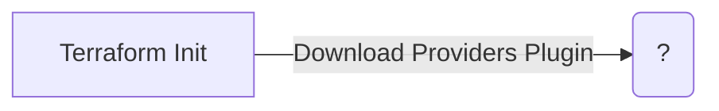

# Providers

A provider in Terraform is a plugin that enables interaction with an API. 
The majority of the providers are maintained in the Terraform Registry, but each of them has it own release cycle.


## Reading
- [Overview Providers](https://developer.hashicorp.com/terraform/language/providers)
- [Provider Configuration](https://developer.hashicorp.com/terraform/language/providers/configuration)
- [Provider Requirements](https://developer.hashicorp.com/terraform/language/providers/requirements)
- [AWS Get Started](https://developer.hashicorp.com/terraform/tutorials/aws-get-started/aws-build)

## Practical Work

The first steps in providing your infrastructure in terraform are the following:

1. Create inside a folder a `main.tf` file
2. We will consider a provider for AWS, add the following content
    ```hcl
    terraform {
      required_providers {
        aws = {
          source  = "hashicorp/aws"
          version = "~> 4.16"
        }
      }
    
      required_version = ">= 1.2.0"
    }
    
    provider "aws" {
      region  = "eu-central-1"
    }
    ```
3. Open a terminal inside that folder and run `terraform init` (or `tflocal init` when using LocalStack)
4. This will create a lock file called `.terraform.lock.hcl` which specifies the exact providers versions
5. And it will create `.terraform` folder where the actual provider implementation resides.
6. Lastly, you can run `terraform fmt` (or `tflocal fmt`) to format all the code in the directory

## The Terraform Pipeline



