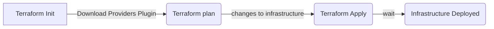
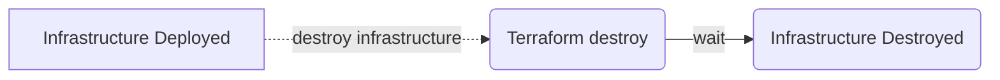
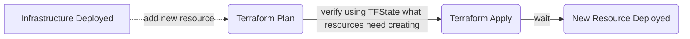

# Resources

Each resource describes one or more infrastructure objects such as virtual networks, compute instances, etc.

## Reading

- [Overview Resources](https://developer.hashicorp.com/terraform/language/resources)
- [Syntax](https://developer.hashicorp.com/terraform/language/resources/syntax)
- [Provisioning Infrastructure](https://developer.hashicorp.com/terraform/cli/run)

## Practical Work

We will create an S3 bucket used for storing and downloading files in AWS

1. Create a new file called `s3.tf`
2. Look over at aws provider documentation for an [S3 bucket](https://registry.terraform.io/providers/hashicorp/aws/4.8.0/docs/resources/s3_bucket)
3. Create the resource block
    ```hcl
        resource "aws_s3_bucket" "tt-bucket" {
          bucket = "tt-bucket"
        }
    ```
4. Open a terminal in the folder and run `<terraform / tflocal> validate` to validate your terraform code
5. To see what changes will happen run `<terraform / tflocal> plan`
6. Observe the changes that will happen on terminal output
7. Run `<terraform / tflocal> apply` and approve this changes
8. Run `<aws / awslocal> s3api list-buckets` and you should observe that the bucket was created
9. Run `<terraform / tflocal> destroy` and approve this changes
10Repeat the aws command from the previous step, and you should have an empty list

## The Terraform Pipeline

### Create resources



### Destroy resources



### Add new resource

