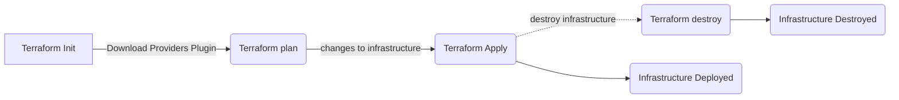

# Resources

Each resource describes one or more infrastructure objects such as virtual networks, compute instances, etc.

## Reading

- [Overview Resources](https://developer.hashicorp.com/terraform/language/resources)
- [Syntax](https://developer.hashicorp.com/terraform/language/resources/syntax)
- [Provisioning Infrastructure](https://developer.hashicorp.com/terraform/cli/run)

## Practical Work

We will create an S3 bucket used for storing and downloading files in AWS

1. Create a new file called `s3.tf`
2. Look over at aws provider documentation for an [S3 bucket](https://registry.terraform.io/providers/hashicorp/aws/4.8.0/docs/resources/s3_bucket)
3. Create the resource block
    ```hcl
        resource "aws_s3_bucket" "tt-bucket" {
          bucket = "tt-bucket"
        }
    ```
4. Open a terminal in the folder and run `terraform plan` (or `tflocal plan` when using LocalStack)
5. Observe the changes that will happen on terminal output
6. Run `terraform apply` (or `tflocal apply` when using LocalStack) and approve this changes
7. Run `aws s3api list-buckets` (or `awslocal s3api list-buckets` when using LocalStack) and you should observe that the bucket was created
8. Run `terraform destroy` (or `tflocal destroy`) and approve this changes
9. Repeat the aws command from the previous step and you should have an empty list

## The Terraform Pipeline

